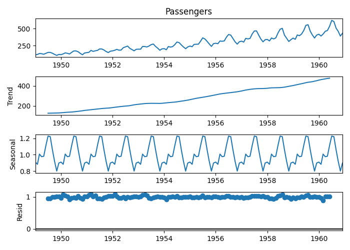

```{r setup, include=FALSE}
knitr::opts_chunk$set(echo = TRUE)
library(tidyverse)
library(knitr)
library(kableExtra)
library(tsibble)
library(lubridate)
library(hrbrthemes)
library(tsibbledata)
library(reticulate)
knitr::knit_engines$set(python = reticulate::eng_python)

thematic::thematic_rmd()

```

## {.tabset}

### Recursos

* OpenIntro Statistics: https://stat.duke.edu/books/openintro-statistics
  
* Rob J Hyndman (In Hyndsight) https://robjhyndman.com/
  
* Series de Tiempo y Modelos de Pronóstico: https://michaela-kratofil.com/files/2009_Book_IntroductoryTimeSeriesWithR.pdf
  
* Algunas funciones en R para series de tiemp: https://nicholasrjenkins.science/post/tidy_time_series/tts_r/
  
* Bases de datos: https://stat2labs.sites.grinnell.edu/DataResources.html
  
* Visualización de datos en R: https://r-graph-gallery.com/

### Introducción a los modelos de pronósticos en series de tiempo

<h3> Intro </h3> 

Cowpertwait, P., Metclafe, A. Introductory Time Series With R. Springer.

* In most branches of science, engineering, and commerce, there are variables
measured sequentially in time.
  
* Observations that have been collected over fixed sampling intervals form a
historical time series.
  
* In statistics, historical series are treated as realisations of sequences of random variables.

* The main features of many time series are trends and seasonal variations that can be modelled deterministically with mathematical functions of time. But, another important feature of most time series is that observations close together in time tend to be correlated (serially dependent). 

* Much of the methodology in a time series analysis is aimed at explaining this correlation and the main features in the data using appropriate statistical models and descriptive methods.

* Once a good model is found and fitted to data, the analyst can use the model to forecast future values, or generate simulations, to
guide planning decisions.

<h3> Sampling </h3> 
  
* Sampling intervals differ in their relation to the data.
  
*  If data are sampled, the sampling interval must be short enough for the time series
to provide a very close approximation to the original continuous signal when it is interpolated.
  
<h3> Características de la Serie de Tiempo </h3>

```{r message=FALSE, error=FALSE, fig.show='hold', out.width='50%'}

data(AirPassengers)
AP <- AirPassengers

plot(AP, ylab = "Passengers (1000's)")
 

AP %>% 
  as_tsibble() %>% 
  ggplot(aes(index, value)) +
    geom_line(color='#00B2A8') +
    theme_ipsum()

``` 
* In general, a systematic change in a time series that does not appear to be
periodic is known as a trend. The simplest model for a trend is a linear increase
or decrease, and this is often an adequate approximation.
  
* A repeating pattern within each year is known as seasonal variation, although the term is applied more generally to repeating patterns within any fixed period, such as restaurant bookings on different days of the week.
  
* Sometimes we may claim there are cycles in a time series that do not correspond to some fixed natural period; examples may include business cycles or
climatic oscillations such as El Ni˜no

* A time series plot not only emphasises patterns and features of the data but can also expose outliers and erroneous values. One cause of the latter is that missing data are sometimes coded using a negative value. Such values need to be handled differently in the analysis and must not be included as observations when fitting a model to data.
  
```{r message=FALSE, error=FALSE, fig.show='hold', out.width='50%'}

AP %>% 
  as_tsibble() %>% 
  index_by(year = ~ year(.)) %>% 
  summarise(passengers = sum(value)) %>% 
  ggplot(aes(year, passengers)) +
  geom_line(color='#00B2A8') +
  theme_ipsum()


AP %>% 
  as_tsibble() %>% 
  ggplot(aes(index, value)) +
    geom_line(color='#00B2A8') +
    geom_smooth(alpha=0.7, colour = '#1C2D44', se=F, method='loess', linetype=3) +
    theme_ipsum()
  

```

```{r message=FALSE, error=FALSE, fig.show='hold', out.width='50%'}

AP_month <-
  AP %>% 
  as_tsibble() %>% 
  index_by(month = ~ lubridate::month(., label=F)) %>% 
  summarise(passengers = sum(value)) %>% 
  mutate(m = lubridate::month(month, label=T)) %>% 
  ungroup()

AP_month %>% 
  ggplot(aes(x=month, y=passengers)) +
  geom_line(color='#00B2A8') +
  theme_ipsum() +
  scale_x_discrete(limits = unique(AP_month$m), labels=unique(AP_month$m))
  
AP %>% 
  as_tsibble() %>% 
 # index_by(month = ~ lubridate::month(., label=T)) %>% 
#  summarise(passengers = sum(value)) %>% 
  mutate(month=month(index, label=T)) %>% 
  ggplot(aes(month, value, group=month, color=month, fill=month)) +
  geom_boxplot(stat = "boxplot",position = "dodge2") +
  theme_ipsum() +
  theme(
    legend.position = 'none'
  )
  

```
  
<h3> Decomposition of series and notation </h3>

* We represent a time series of length n by {$x_{t} : t = 1, . . . , n$} = {$x_{1}, x_{2}, . . . , x_{n}$}.

* It consists of n values sampled at discrete times 1, 2, . . . , n.

* {xt} when the length n of the series does not need to be specified.

* An overline is used for sample means: $$\overline{x}  = \sum x_{i}/n$$

* The ‘hat’ notation will be used to represent a prediction or forecast. For example, with the series ${x_{t} : t = 1, . . . , n}$, $\hat{x}_{t+k|t}$ is a forecast made at time t for a future value at time t + k. A forecast is a predicted future value, and the number of time steps into the future is the lead time (k).

```{r, eval=TRUE}

decomposed_AP <- decompose(AirPassengers,type = 'multiplicative')

decomposed_AP

```


```{python, eval=TRUE}

import pandas as pd
import numpy as np
import matplotlib.pyplot as plt
import seaborn as sns
from datetime import datetime
from itertools import combinations
from sklearn.metrics import mean_absolute_error
from sklearn.metrics import mean_squared_error
from statsmodels.tsa.stattools import adfuller
from statsmodels.tsa.stattools import acf, pacf
from statsmodels.tsa.arima.model import ARIMA as ARIMA
import statsmodels.api as sm
import statsmodels.tsa.api as smt
import matplotlib
from statsmodels.tsa.seasonal import seasonal_decompose
matplotlib.use('Qt5Agg')

# 'https://www.kaggle.com/rakannimer/air-passengers'

data=pd.read_csv('AirPassengers.csv')
data['Date'] = pd.to_datetime(data['Month'])
data = data.drop(columns = 'Month')
data = data.set_index('Date')
data = data.rename(columns = {'#Passengers':'Passengers'})
data.head()

result=seasonal_decompose(data['Passengers'], model='multiplicative', period=12)

p=result.plot()

p.savefig('decomposed_p.png')

```



### Modelos de pronósticos en series de tiempo

<h3> Additive decomposition model </h3>

* A simple additive decomposition model is given by: $$x_{t} = m_{t} + s_{t} + z_{t}$$ where, at time t, $x_{t}$ is the observed series, $m_{t}$ is the trend, $s_{t}$ is the seasonal effect, and $z_{t}$ is an error term that is, in general, a sequence of correlated random variables with mean zero.

* If the seasonal effect tends to increase as the trend increases, a multiplicative model may be more appropriate: $$x_{t} = m_{t} * s_{t} +z_{t}$$

* If the random variation is modelled by a multiplicative factor and the variable is positive, an additive decomposition model for $log(x_{t})$ [log means natural logarithm, sometimes written $ln$] can be used: $$log(x_{t}) = m_{t} + s_{t} + z_{t}$$

* Some care is required when the exponential function is applied to the predicted mean of $log(x_{t})$ to obtain a prediction for the mean value $x_{t}$, as the effect is usually to bias the predictions. If the random series $z_{t}$ are normally distributed with mean 0 and variance $\sigma^{2}$, then the predicted mean value at time t based on the above equation is given by: $$\hat{x}_{t} = e^{m_{t}+s_{t}}e^{\frac{1}{2}\sigma^{2}}$$ However, if the error series is not normally distributed and is negatively skewed (i.e. its probability has a long tail to the left) as is often the case after taking logarithms, the bias correction factor will be an overcorrection and it is preferable to apply an empirical adjustment.
  
<h3>  Estimating trends and seasonal effects </h3>
  
* There are various ways to estimate the trend $m_{t}$ at time $t$, but a relatively simple procedure, which is available in R and does not assume any specific form is to calculate a moving average centred on $x_{t}$.

* For monthly series, we need to average twelve consecutive months, but there is a slight snag. Suppose our time series begins at January ($t = 1$) and we average January up to December ($t = 12$). This average corresponds to a time $t = 6.5$, between June and July. When we come to estimate seasonal effects, we need a moving average at integer times. This can be achieved by averaging the average of January up to December and the average of February ($t = 2$) up to January ($t = 13$). This average of two moving averages corresponds to t = 7, and the process is called centring. Thus the trend at time t can be estimated by the centred moving average $$\hat{m_{t}} = \frac{\frac{1}{2}x_{t-6} + x_{t-5} + ... + x_{t-1} + x_{t} + x_{t+1} + ... x_{t+5} + \frac{1}{2}x_{t+6}}{12}$$ where $t = 7, . . . , n − 6$. The coefficients in above equation for each month are 1/12 (or sum to 1/12 in the case of the first and last coefficients), so that equal weight is given to each month and the coefficients sum to 1. By using the seasonal frequency for the coefficients in the moving average, the procedure generalises for any seasonal frequency (e.g., quarterly series), provided the condition that the coefficients sum to unity is still met.

* An estimate of the monthly additive effect ($s_{t}$) at time $t$ can be obtained by subtracting $\hat{m}_{t}$: $$\hat{s}_{t} = x_{t} − \hat{m}_{t}$$
  
* If the monthly effect is multiplicative, the estimate is given by division: $$\hat{s}_{t} = x_{t}/\hat{m}_{t}$$


<h3> Smoothing </h3>

The centred moving average is an example of a smoothing procedure that is applied retrospectively to a time series with the objective of identifying an underlying signal or trend.

### Modelos estacionarios y no estacionarios 

* The mean function of a time series model is $$\mu(t) = E(x_{t})$$ The expectation in this definition is an average taken across the ensemble of all the possible time series that might have been produced by the time series model.

* The ensemble constitutes the entire population. If we have a time series model, we can simulate more than one time series.

* If the mean function is constant, we say that the time series model is stationary in the mean, $$\overline{x} = \sum_{t=1}^{n} x_{t}/n$$ This equation does rely on an assumption that a sufficiently long time series characterises the hypothetical model. Such models are known as ergodic. $$\displaystyle \lim_{x \to \infty} \frac{\sum{x_{t}}}{n} = \mu$$
  
* It is straightforward to adapt a stationary time series model to be non-ergodic by defining the means for the individual time series to be from some probability distribution.
  
* The variance function of a time series model that is stationary in the mean is $$\sigma^{2}(t) = E[(x_{t} - \mu^2)]$$ which can, in principle, take a different value at every time $t$. But we cannot estimate a different variance at each time point from a single time series. To progress, we must make some simplifying $\sigma^{2}$, can be estimated from the sample variance: $$Var(x) = \frac{\Sigma(x_{t} - \overline{x})^2}{n-1}$$
  
* In a time series analysis, sequential observations may be correlated. If the correlation is positive, $Var(x)$ will tend to underestimate the population variance in a short series because successive observations tend to be relatively similar. In most cases, this does not present a problem since the bias decreases rapidly as the length n of the series increases.

<h3> Autocorrelation </h3>

* The mean and variance play an important role in the study of statistical distributions because they summarise two key distributional properties – a central location and the spread. Similarly, in the study of time series models, a key role is played by the second-order properties, which include the mean, variance, and serial correlation.

* A correlation of a variable with itself at different times is known as autocorrelation or serial correlation. If a time series model is second-order stationary, we can define an autocovariance function (acvf ), $r_{k}$ , as a function of the lag $k$: $$\gamma_{k} = E[(x_{t} - \mu)(x_{t+k}-\mu)]$$

* The function $\gamma_{k}$ does not depend on $t$ because the expectation, which is across the ensemble, is the same at all times $t$. This definition follows naturally from the above equation by replacing $x$ with $x_{t}$ and $y$ with $x_{t+k}$ and noting that the mean $\mu$ is the mean of both $x_{t}$ and $x_{t+k}$. The lag $k$ autocorrelation function $(acf)$, $\rho_{k}$ , is defined by: $$\rho_{k} = \frac{\gamma_{k}}{\sigma^{2}}$$

* The acvf and acf can be estimated from a time series by their sample equivalents. The sample acvf, ck, is calculated as $$c_{k} = \frac{1}{n} \sum_{t = 1}^{n-k} (x_{t}-\overline{x})(x_{t+k} - \overline{x})$$

* The sample acf is defined as $$r_{k} = \frac{c_{k}}{c_{0}}$$

```{r eval=TRUE}

AirPassengers %>% 
  as_tsibble %>% 
  ggplot(aes(index,value)) +
  geom_line(colour='#00B2A8') +
  theme_ipsum()

```
```{r eval=TRUE, fig.show='hold', out.width='50%'}
# autocorrelation
acf(AirPassengers, )$acf

# autocovariance
acf(AirPassengers, type = c("covariance"))$acf

```
* The x-axis gives the $lag (k)$ and the y-axis gives the autocorrelation $(r_{k})$ at each lag. The unit of lag is the sampling interval, 0.1 second. Correlation is dimensionless, so there is no unit for the y-axis.
  
* If $\rho_{k} = 0$, the sampling distribution of $r_{k}$ is approximately normal, with a mean of $\frac{−1}{n}$ and a variance of $\frac{1}{n}$. The dotted lines on the correlogram are drawn at $$-\frac{1}{n}\pm\frac{2}{\sqrt{n}}$$

* The main use of the correlogram is to detect autocorrelations in the time series after we have removed an estimate of the trend and seasonal variation. 

```{r, eval=TRUE}

AP_decomposed <- decompose(AirPassengers, "multiplicative")
plot(ts(AP_decomposed$random[7:138]))  
acf(AP_decomposed$random[7:138])
```

* The correlogram above suggests either a damped cosine shape that is characteristic of an autoregressive model of order 2 (Chapter 4) or that the seasonal adjustment has not been entirely effective. The latter explanation is unlikely because the decomposition does estimate twelve independent monthly indices. If we investigate further, we see that the standard deviation of the original series from July until June is 109, the standard deviation of the series after subtracting the trend estimate is 41, and the standard deviation after seasonal adjustment is just 0.03.

```{r eval=TRUE}

sd(AP[7:138])
sd(AP[7:138] - AP_decomposed$trend[7:138])
sd(AP_decomposed$random[7:138])

```

### ARIMA

<!-- https://www.kaggle.com/code/tanmay111999/air-passenger-forecast-arima-sarima -->

As the differenced series needs to be aggregated (or ‘integrated’) to recover the original series, the underlying stochastic process is called ARIMA (Auto Regressive Integrated Moving Average). The ARIMA process can be extended to include seasonal terms, giving a non-stationary seasonal ARIMA (SARIMA) process. Seasonal ARIMA models are powerful tools in the analysis of time series as they are capable of modelling a very wide range of series. Much of the methodology was pioneered by Box and Jenkins in the 1970’s.
  
Series may also be non-stationary because the variance is serially correlated (technically known as conditionally heteroskedastic), which usually re- sults in periods of volatility, where there is a clear change in variance.

* AR Auto Regressive. 'p' is the number of auto regressive terms.
 
* I (d): Integrated. Number of differencing orders required to make the time series stationary.
 
* MA (q): Moving Average.  Number of lagged forecast errors in the prediction equation.
 
* p,d, & q are known as the order of the ARIMA model.

Selection criteria for the order of ARIMA model:

p: Lag value where the Partial Autocorrelation (PACF) graph cuts off or drops to 0 for the 1st instance. In general, the "partial" correlation between two variables is the amount of correlation between them which is not explained by their mutual correlations with a specified set of other variables. For example, if we are regressing a variable Y on other variables X1, X2, and X3, the partial correlation between Y and X3 is the amount of correlation between Y and X3 that is not explained by their common correlations with X1 and X2. This partial correlation can be computed as the square root of the reduction in variance that is achieved by adding X3 to the regression of Y on X1 and X2.

d: Number of times differencing is carried out to make the time series stationary.
  
q: Lag value where the Autocorrelation (ACF) graph crosses the upper confidence interval for the 1st instance. A partial autocorrelation is the amount of correlation between a variable and a lag of itself that is not explained by correlations at all lower-order-lags. The autocorrelation of a time series Y at lag 1 is the coefficient of correlation between Yt and Yt-1, which is presumably also the correlation between Yt-1 and Yt-2. But if Yt is correlated with Yt-1, and Yt-1 is equally correlated with Yt-2, then we should also expect to find correlation between Yt and Yt-2. In fact, the amount of correlation we should expect at lag 2 is precisely the square of the lag-1 correlation. Thus, the correlation at lag 1 "propagates" to lag 2 and presumably to higher-order lags. The partial autocorrelation at lag 2 is therefore the difference between the actual correlation at lag 2 and the expected correlation due to the propagation of correlation at lag 1.

```{python, eval=TRUE}
import pandas as pd
import numpy as np
import matplotlib.pyplot as plt
import seaborn as sns
from datetime import datetime
from itertools import combinations
from sklearn.metrics import mean_absolute_error
from sklearn.metrics import mean_squared_error
from statsmodels.tsa.stattools import adfuller
from statsmodels.tsa.stattools import acf, pacf
from statsmodels.tsa.arima.model import ARIMA as ARIMA
import statsmodels.api as sm
import statsmodels.tsa.api as smt
import matplotlib
matplotlib.use('Qt5Agg')

# 'https://www.kaggle.com/rakannimer/air-passengers'

data=pd.read_csv('AirPassengers.csv')
data['Date'] = pd.to_datetime(data['Month'])
data = data.drop(columns = 'Month')
data = data.set_index('Date')
data = data.rename(columns = {'#Passengers':'Passengers'})
data.head()

result=seasonal_decompose(data['Passengers'], model='multiplicative', period=12)

p=result.plot()

p.savefig('decomposed_p.png')

```


* Linear uptrend.
* Yearly seasonal pattern

<h3> Testing Stationarity </h3>

* Augmented Dickey Fuller Test
* Null Hypothesis: It assumes that the time series is non-stationary.
* Alternate Hypothesis: If the null hypothesis is rejected, then the time series is stationary.

Output of the Augmented Dickey Fuller Test include :
* Test Statistic
* p-value
* #Lags Used
* Number of Observations Used
* Critical Value (1%)
* Critical Value (5%)
* Critical Value (10%)

For the null hypothesis to be rejected there are 2 requirements:
  
* Critical Value (5%) > Test Statistic
* p-value < 0.05

```{python, eval=TRUE, warnings=FALSE}
def test_stationarity(timeseries):
    #Determing rolling statistics
    MA = timeseries.rolling(window=12).mean()
    MSTD = timeseries.rolling(window=12).std()

    #Plot rolling statistics:
    plt.figure(figsize=(15,5))
    orig = plt.plot(timeseries, color='blue',label='Original')
    mean = plt.plot(MA, color='red', label='Rolling Mean')
    std = plt.plot(MSTD, color='black', label = 'Rolling Std')
    plt.legend(loc='best')
    plt.title('Rolling Mean & Standard Deviation')
    plt.show(block=False)

    #Perform Dickey-Fuller test:
    print('Results of Dickey-Fuller Test:')
    dftest = adfuller(timeseries, autolag='AIC')
    dfoutput = pd.Series(dftest[0:4], index=['Test Statistic','p-value','#Lags Used','Number of Observations Used'])
    for key,value in dftest[4].items():
        dfoutput['Critical Value (%s)'%key] = value
    print(dfoutput)

test_stationarity(data['Passengers'])

```

* Test Statistic: 0.82 > Critical Value (5%) :-2.88
* p-value 0.99 > 0.05
  
Hence the null hypothesis cannot be rejected and we can conclude that the time series is non-stationary.
  
In order to eliminate trend, seasonality and make the time series stationary, we will use differencing i.e subtracting the previous value from it's next value and log transform. We must make note of how many differencing iterations have been done as this is d.

```{python eval=TRUE, warning=FALSE}

# Original Series
fig, (ax1, ax2, ax3) = plt.subplots(3)
ax1.plot(data.Passengers); ax1.set_title('Original Series'); ax1.axes.xaxis.set_visible(False)
# 1st Differencing
ax2.plot(data.Passengers.diff()); ax2.set_title('1st Order Differencing'); ax2.axes.xaxis.set_visible(False)
# 2nd Differencing
ax3.plot(data.Passengers.diff().diff()); ax3.set_title('2nd Order Differencing')
plt.show()
```

```{python eval=TRUE, warning=FALSE}
from statsmodels.graphics.tsaplots import plot_acf
fig, (ax1, ax2, ax3) = plt.subplots(3)
plot_acf(data.Passengers, ax=ax1)
plot_acf(data.Passengers.diff().dropna(), ax=ax2)
plot_acf(data.Passengers.diff().diff().dropna(), ax=ax3)
plt.show()
```
  
Here we can see how the time series has become 'almost' stationary. One thing which is noticeable here is in first-order differencing we have less noise in the data while after 1st order there is an increase in the noise. 
  
In second-order differencing the immediate lag has gone on the negative side, representing that in the second-order the series has become over the difference. 

So we can select 1st order differencing for our model. We will also log transform the data. 
  
```{python eval=TRUE, warning=FALSE}
data_diff = data
data_diff['Passengers'] = np.log(data['Passengers'])
data_diff = data_diff.diff()
data_diff = data_diff.dropna()
dec = sm.tsa.seasonal_decompose(data_diff,period = 12).plot()
plt.show()

```

Then we can check again for stationarity with Dickey Fuller test:

```{python eval=TRUE}
test_stationarity(data_diff)
```
  
From the outputs of the Augmented Dickey Fuller Test:
  
* Rolling Mean is close to 0 -- ok
* Rolling Standard Deviation is close to 0.1 -- ok
* Test Statistic: -2.37 < Critical Value 5%: -2.88 -- ok
* p-value: 0.07 > 0.05 -- not!
  
The time series is still strictly speaking non-stationary, but we will proceed as though it were stationary.
  
```{python eval=TRUE, warning=FALSE}
def tsplot(y, lags=None, figsize=(12, 7), style='bmh'):
    if not isinstance(y, pd.Series):
        y = pd.Series(y)
        
    with plt.style.context(style):    
        fig = plt.figure(figsize=figsize)
        layout = (2, 2)
        ts_ax = plt.subplot2grid(layout, (0, 0), colspan=2)
        acf_ax = plt.subplot2grid(layout, (1, 0))
        pacf_ax = plt.subplot2grid(layout, (1, 1))
        
        y.plot(ax=ts_ax)
        p_value = sm.tsa.stattools.adfuller(y)[1]
        ts_ax.set_title('Time Series Analysis Plots\n Dickey-Fuller: p={0:.5f}'.format(p_value))
        smt.graphics.plot_acf(y, lags=lags, ax=acf_ax)
        smt.graphics.plot_pacf(y, lags=lags, ax=pacf_ax,method='ywm')
        plt.tight_layout()
        plt.show()

tsplot(data_diff['Passengers'])

```
  
To remind ourselves:
  
* p is the number of autoregressive terms. Draw a partial autocorrelation graph(ACF) of the data. This will help us in finding the value of p because the cut-off point to the PACF is p. Using the PACF plot we can take the order of AR terms to be equal to the lags that *can* cross a significance limit. 
  
* d is the number of nonseasonal differences. If the time series is stationary try to fit the ARMA model, and if the time series is non-stationary then seek the value of d. We used 1 differencing term (see diff())
  
* q is the number of lagged forecast errors in the prediction equation. Draw an autocorrelation graph (ACF) of the data. It will tell us how much moving average is required to remove the autocorrelation from the stationary time series. Number of points which 
  
From the above plots, the following order of ARIMA model is selected from the selection criteria mentioned above:
  
* p: 2
* d: 1
* q: 2

Thus, the parameters p and q are selected in such a way that we pass their values assuming the ARIMA model carries out the differencing process and makes the time series stationary.
  
```{python eval=TRUE, warning=FALSE}

import warnings
warnings.filterwarnings('ignore')

model = ARIMA(
  data['Passengers'],
  order = (2,1,2)
  )

model_fit = model.fit()

print(model_fit.summary())

```
  
<h3> In-sample Forecasting </h3>
  
* Model forecasts values for the existing data points of the time series. It is similar to the train - test format data split.
  
* We divide the data into train and test datasets. We reserve the last 30 elements for the test set and the remaining for the train set.
  
* For this in-sample Forecasting, we use the rolling forecast method i.e we predict or forecast a single value and use this predicted value again for model fitting for predicting the next value.

```{python eval=TRUE, warning=FALSE}
import warnings
warnings.filterwarnings('ignore')

size = int(len(data) - 30)
train, test = data['Passengers'][0:size], data['Passengers'][size:len(data)]

print('\t ARIMA MODEL : In- Sample Forecasting \n')

history = [x for x in train]
predictions = []

for t in range(len(test)):
    
    model = ARIMA(history, order=(2,1,2))
    model_fit = model.fit()
    
    output = model_fit.forecast()
    yhat = output[0]
    predictions.append(float(yhat))
    
    obs = test[t]
    history.append(obs)
    
    print('predicted = %f, expected = %f' % (yhat, obs))
    
```

```{python eval=TRUE, warning=FALSE}
predictions_series = pd.Series(predictions, index = test.index)
fig,ax = plt.subplots(nrows = 1,ncols = 1,figsize = (15,5))
plt.subplot(1,1,1)
plt.plot(data['Passengers'],label = 'Expected Values')
plt.plot(predictions_series, label = 'Predicted Values');
plt.legend(loc="upper left")
plt.show()

```

```{python eval=TRUE, warning=FALSE}
error = np.sqrt(mean_squared_error(test,predictions))
print('Test RMSE: %.4f' % error)
```
  
* Test RMSE value is relatively high.
  
* The effect of seasonality and the order of the ARIMA model might have had an effect on model performance. 

<hr> Out-of-sample Forecasting </hr>

* Model forecasts values for future data points by creating a datetime index for the time series.
  
* We create a new data frame with the future index values and same columns as the data frame that we use for model fitting.
  
* We use the rolling method by using forecast function and predict function.
  
* In the rolling method, we forecast or predict the next single value, use this predicted value again for model fitting that is then used for predicting the next value.
  
```{python eval=TRUE, warning=FALSE}
from pandas.tseries.offsets import DateOffset
import datetime

future_dates = [data.index[-1] + DateOffset(weeks = x) for x in range(0,49)]

# New dataframe for storing the future values
df1 = pd.DataFrame(index = future_dates[1:], columns = data.columns)

forecast = pd.concat([data, df1])

forecast['ARIMA_Forecast_Function'] = np.NaN

forecast['ARIMA_Predict_Function'] = np.NaN

forecast.head()

```


```{python}
ARIMA_history_f = [x for x in train]

f1 = []

for t in range(len(df1)):
    
    model = ARIMA(ARIMA_history_f, order = (2,1,2))
    model_fit = model.fit()
    
    output = model_fit.forecast()[0]
    
    ARIMA_history_f.append(output)
    f1.append(output)
    
for i in range(len(f1)):

    forecast.iloc[144 + i, 1] = f1[i]

forecast.tail()

```

```{python eval=TRUE, warning=FALSE}
predictions_series = pd.Series(predictions, index = test.index)

fig,ax = plt.subplots(nrows = 1,ncols = 1,figsize = (12,8))
plt.subplot(1,1,1)
plt.plot(forecast[['Passengers','ARIMA_Forecast_Function']], label = ['Observed Values','Forecast Values'])
plt.legend(loc="upper left")
plt.show()

```

<h3> Predict Function </h3>

```{python eval=TRUE, warning=FALSE}
ARIMA_history_p = [x for x in train]
f2 = []

for t in range(len(df1)):
    
    model = ARIMA(ARIMA_history_p, order = (2,1,2))
    
    model_fit = model.fit()
    
    output = model_fit.predict(start = len(ARIMA_history_p),
                               end = len(ARIMA_history_p),
                               typ = 'levels')[0]
    
    ARIMA_history_p.append(output)
    f2.append(output)
    
for i in range(len(f2)):
    forecast.iloc[144 + i,2] = f2[i]
forecast.tail()

```

```{python eval=TRUE, warning=FALSE}
predictions_series = pd.Series(predictions, index = test.index)

fig,ax = plt.subplots(nrows = 1,ncols = 1,figsize = (12,8))
plt.subplot(1,1,1)
plt.plot(forecast[['Passengers','ARIMA_Predict_Function']], label = ['Observed Values','Predicted Values'])
plt.legend(loc="upper left")
plt.show()

```

* For the above trained ARIMA model, values generated by forecast_function and predict function are either exactly identical or just differ by a few decimal points!
  
* The model clearly did not capture the seasonal patterns of the data.

### SARIMA

*Seasonal Auto Regressive Integrated Moving Average model is an extension of the ARIMA model that can handle the seasonal effects of the data. It has two orders: p,d,q and P,D,Q,M.
  
* p,d,q) is an order that is similar to the order of the ARIMA model.
  
* P,D,Q,M is known as the Seasonal Order where P,D,Q are similar to p,d,q of ARIMA.
   
* To select M, we need to difference the data by the periodicity of the seasonal terms M and then check the PACF & ACF values at the Mth lag value.
  
```{python eval=TRUE, warning=FALSE}

data_diff_seas = data_diff.diff(12)
data_diff_seas = data_diff_seas.dropna()
dec = sm.tsa.seasonal_decompose(data_diff_seas,period = 12)
dec.plot()
plt.show()

```

* Our data is in monthly format and the seasonal period is of 1 year.
  
* Hence, we difference the already differenced data by a periodicity, M, value of 12.
  
* The seasonality of the data has not completely died down but it's values have been dropped.
  
* We will check this seasonal differenced data for stationarity.
  
```{python eval=TRUE, warning=FALSE}

test_stationarity(data_diff_seas['Passengers'])

```
From the outputs of the Augmented Dickey Fuller Test:
  
* Rolling Mean is very close to 0.

* Rolling Standard Deviation is almost constant with certain crests.

* Critical Value 1%: - 3.48 > Test Statistic: -4.424645. We can say that the time series is stationary with 99% confidence as the Test Statistic is less than Critical Value (1%) as well.

* p-value 0.000268 < 0.05

* We can reject the null hypothesis i.e the above time series is stationary.
  
```{python eval=TRUE, warning=FALSE}

tsplot(data_diff_seas['Passengers'])

```

* p,d,q retain the same values as the ones used in ARIMA (2,1,2)
  
* P,D,Q,M:

* P : 1, D : 1, Q : 1, M : 12

```{python eval=TRUE, warning=FALSE}
model = sm.tsa.statespace.SARIMAX(data['Passengers'],order = (2,1,2),seasonal_order = (0,1,1,12))
model_fit = model.fit()
print(model_fit.summary())
```

<hr> In-sample Forecasting </hr>
  
In-sample Forecasting: Model forecasts values for the existing data points of the time series. It is similar to the train - test format for regression or classification problems.
  
We divide the data into train and test dataset. We reserve the last 30 elements for the test dataset and the remaining for the train dataset similar to the approach of ARIMA model.
  
For this In-sample Forecasting, we use the rolling forecast method i.e we predict or forecast a single value and use this predicted value again for model fitting for predicting the next value.
  
```{python eval=TRUE, warning=FALSE, include=FALSE}

size = int(len(data) - 30)
train, test = data['Passengers'][0:size], data['Passengers'][size:len(data)]

print('\t SARIMA MODEL : In - Sample Forecasting \n')

history = [x for x in train]
predictions = []

for t in range(len(test)):
    
    model = sm.tsa.statespace.SARIMAX(history,order = (2,1,2),seasonal_order = (0,1,1,12))
    model_fit = model.fit()
    
    output = model_fit.forecast()
    
    yhat = output[0]
    predictions.append(float(yhat))
    
    obs = test[t]
    history.append(obs)
    
    print('predicted = %f, expected = %f' % (yhat, obs))

```

```{python eval=TRUE, warning=FALSE, include=FALSE}

predictions_series = pd.Series(predictions, index = test.index)
fig,ax = plt.subplots(nrows = 1,ncols = 1,figsize = (15,5))

plt.subplot(1,1,1)
plt.plot(data['Passengers'],label = 'Expected Values')
plt.plot(predictions_series,label = 'Predicted Values');
plt.legend(loc="upper left")
plt.show()

```

```{python eval=TRUE, warning=FALSE}
error = np.sqrt(mean_squared_error(test,predictions))
print('Test RMSE: %.4f' % error)
```

<hr> Out - of - Sample Forecasting </hr>

* Out-of-Sample Forecasting: Model forecasts values for the future data points by generating the datetime index values of the time series.
  
* We create a new dataframe with the future index values and same columns as the data frame that we use for model fitting. 
  
* We use the non-rolling method by using forecast and predict functions.
  
* In the non-rolling method, we forecast or predict all future values at once. We store these future values into 2 new columns SARIMA_Forecast_Function and SARIMA_Predict_Function in the existing forecast dataframe.
  
```{python eval=TRUE, warning=FALSE}
forecast['SARIMA_Forecast_Function'] = np.NaN
forecast['SARIMA_Predict_Function'] = np.NaN
forecast.head()

```

```{python eval=TRUE, warning=FALSE}

SARIMA_history_f = [x for x in train]

f3 = []

for t in (range(len(df1))):
    
    model = sm.tsa.statespace.SARIMAX(SARIMA_history_f,order = (2,1,2),seasonal_order = (0,1,1,12))
    model_fit = model.fit()
    
    output = model_fit.forecast()[0]
    
    SARIMA_history_f.append(output)
    f3.append(output)
    
for i in range(len(f3)):
    forecast.iloc[144 + i,3] = f3[i]

forecast.tail()
```

```{python eval=TRUE, warning=FALSE}

fig,ax = plt.subplots(nrows = 1,ncols = 1,figsize = (12,8))
plt.subplot(1,1,1)
plt.plot(forecast[['Passengers','SARIMA_Forecast_Function']], label = ['Observed Values','Predicted Values'])
plt.legend(loc="upper left")
plt.show()

```
  
From the above graph, we can say that SARIMA learned the trend and seasonal pattern but it did not understand the increasing width of the seasonal pattern that is a characteristic feature of a multiplicative model.
  
```{python eval=TRUE, warning=FALSE}
SARIMA_history_p = [x for x in train]
f4 = []

for t in range(len(df1)):
    
    model = sm.tsa.statespace.SARIMAX(SARIMA_history_p,order = (2,1,2),seasonal_order = (0,1,1,12))
    model_fit = model.fit()
    
    output = model_fit.predict(start = len(SARIMA_history_p),end = len(SARIMA_history_p),typ = 'levels')[0]
    
    SARIMA_history_p.append(output)
    f4.append(output)
    
for i in range(len(f4)):
    forecast.iloc[144 + i,4] = f4[i]
forecast.tail()
```

```{python eval=TRUE, warning=FALSE}

fig,ax = plt.subplots(nrows = 1,ncols = 1,figsize = (12,8))
plt.subplot(1,1,1)
plt.plot(forecast[['Passengers','SARIMA_Predict_Function']], label = ['Observed Values','Predicted Values'])
plt.legend(loc="upper left")
plt.show()

```
